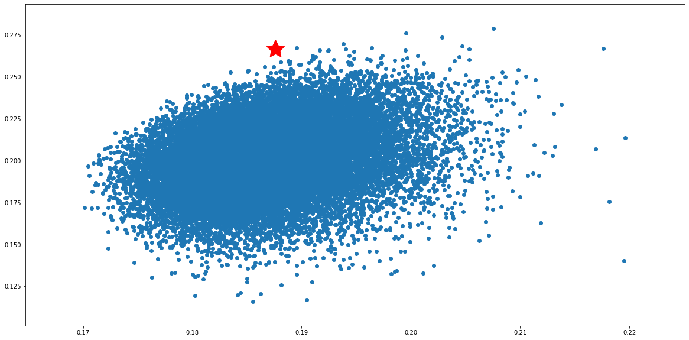

```python
import pandas as pd 
import numpy as np 
import pandas_datareader as dr
from pandas_datareader import data 
```


```python
Equal_Weight=data.DataReader(['AAPL','ADBE','AMZN','CRM','CS','FB','GOOG','IBM','INTC','MSFT','V'],'yahoo',start='2010/04/10', end ='2019/09/26')['Adj Close']
Equal_Weight['FB'][np.isnan(Equal_Weight['FB'])]= 38
Equal_Weight.describe()
```


<div>
<style scoped>
    .dataframe tbody tr th:only-of-type {
        vertical-align: middle;
    }

    .dataframe tbody tr th {
        vertical-align: top;
    }

    .dataframe thead th {
        text-align: right;
    }
</style>
<table border="1" class="dataframe">
  <thead>
    <tr style="text-align: right;">
      <th>Symbols</th>
      <th>AAPL</th>
      <th>ADBE</th>
      <th>AMZN</th>
      <th>CRM</th>
      <th>CS</th>
      <th>FB</th>
      <th>GOOG</th>
      <th>IBM</th>
      <th>INTC</th>
      <th>MSFT</th>
      <th>V</th>
    </tr>
  </thead>
  <tbody>
    <tr>
      <th>count</th>
      <td>2384.000000</td>
      <td>2384.000000</td>
      <td>2384.000000</td>
      <td>2384.000000</td>
      <td>2384.000000</td>
      <td>2384.000000</td>
      <td>2384.000000</td>
      <td>2384.000000</td>
      <td>2384.000000</td>
      <td>2384.000000</td>
      <td>2384.000000</td>
    </tr>
    <tr>
      <th>mean</th>
      <td>102.083919</td>
      <td>101.275000</td>
      <td>661.837890</td>
      <td>71.094089</td>
      <td>19.178540</td>
      <td>91.326233</td>
      <td>636.589022</td>
      <td>135.080524</td>
      <td>28.656581</td>
      <td>50.746156</td>
      <td>67.860667</td>
    </tr>
    <tr>
      <th>std</th>
      <td>51.828065</td>
      <td>80.506580</td>
      <td>560.565621</td>
      <td>39.432016</td>
      <td>6.134387</td>
      <td>56.735298</td>
      <td>310.985068</td>
      <td>16.113428</td>
      <td>11.318767</td>
      <td>32.219039</td>
      <td>44.642510</td>
    </tr>
    <tr>
      <th>min</th>
      <td>29.317430</td>
      <td>22.690001</td>
      <td>108.610001</td>
      <td>19.379999</td>
      <td>9.073497</td>
      <td>17.730000</td>
      <td>217.220810</td>
      <td>90.100533</td>
      <td>13.266715</td>
      <td>18.277956</td>
      <td>13.744343</td>
    </tr>
    <tr>
      <th>25%</th>
      <td>59.033401</td>
      <td>34.127501</td>
      <td>234.367504</td>
      <td>37.799999</td>
      <td>13.701335</td>
      <td>38.000000</td>
      <td>330.042915</td>
      <td>127.463081</td>
      <td>19.040277</td>
      <td>24.631278</td>
      <td>28.640869</td>
    </tr>
    <tr>
      <th>50%</th>
      <td>92.171188</td>
      <td>72.934998</td>
      <td>375.285004</td>
      <td>61.369999</td>
      <td>18.547459</td>
      <td>77.559998</td>
      <td>563.041901</td>
      <td>137.062645</td>
      <td>27.310021</td>
      <td>40.208897</td>
      <td>62.318686</td>
    </tr>
    <tr>
      <th>75%</th>
      <td>139.902905</td>
      <td>136.532494</td>
      <td>948.972504</td>
      <td>86.932499</td>
      <td>23.039030</td>
      <td>141.452499</td>
      <td>915.222504</td>
      <td>146.967560</td>
      <td>33.918640</td>
      <td>65.747713</td>
      <td>90.995295</td>
    </tr>
    <tr>
      <th>max</th>
      <td>227.839798</td>
      <td>311.269989</td>
      <td>2039.510010</td>
      <td>166.949997</td>
      <td>36.235966</td>
      <td>217.500000</td>
      <td>1287.579956</td>
      <td>167.242981</td>
      <td>57.752048</td>
      <td>140.591614</td>
      <td>185.429428</td>
    </tr>
  </tbody>
</table>
</div>


```python
Trailing_12mon = data.DataReader(['AAPL','ADBE','AMZN','CRM','CS','FB','GOOG','IBM','INTC','MSFT','V'],'yahoo', start = '2018/09/26', end = '2019/09/26')['Adj Close']
Daily_Ret_12mon = Trailing_12mon.pct_change()
Trailing_12mon.tail()

```


<div>
<style scoped>
    .dataframe tbody tr th:only-of-type {
        vertical-align: middle;
    }

    .dataframe tbody tr th {
        vertical-align: top;
    }

    .dataframe thead th {
        text-align: right;
    }
</style>
<table border="1" class="dataframe">
  <thead>
    <tr style="text-align: right;">
      <th>Symbols</th>
      <th>AAPL</th>
      <th>ADBE</th>
      <th>AMZN</th>
      <th>CRM</th>
      <th>CS</th>
      <th>FB</th>
      <th>GOOG</th>
      <th>IBM</th>
      <th>INTC</th>
      <th>MSFT</th>
      <th>V</th>
    </tr>
    <tr>
      <th>Date</th>
      <th></th>
      <th></th>
      <th></th>
      <th></th>
      <th></th>
      <th></th>
      <th></th>
      <th></th>
      <th></th>
      <th></th>
      <th></th>
    </tr>
  </thead>
  <tbody>
    <tr>
      <th>2019-09-23</th>
      <td>218.065308</td>
      <td>277.440002</td>
      <td>1785.300049</td>
      <td>154.649994</td>
      <td>12.59</td>
      <td>186.820007</td>
      <td>1234.030029</td>
      <td>140.411606</td>
      <td>50.621399</td>
      <td>138.668152</td>
      <td>174.617523</td>
    </tr>
    <tr>
      <th>2019-09-24</th>
      <td>217.028412</td>
      <td>272.470001</td>
      <td>1741.609985</td>
      <td>152.050003</td>
      <td>12.40</td>
      <td>181.279999</td>
      <td>1218.760010</td>
      <td>140.026138</td>
      <td>49.547310</td>
      <td>136.914124</td>
      <td>174.188232</td>
    </tr>
    <tr>
      <th>2019-09-25</th>
      <td>220.368393</td>
      <td>277.429993</td>
      <td>1768.329956</td>
      <td>152.990005</td>
      <td>12.24</td>
      <td>182.800003</td>
      <td>1246.520020</td>
      <td>141.488876</td>
      <td>50.740742</td>
      <td>138.887405</td>
      <td>174.986908</td>
    </tr>
    <tr>
      <th>2019-09-26</th>
      <td>219.231812</td>
      <td>283.809998</td>
      <td>1739.839966</td>
      <td>152.339996</td>
      <td>12.19</td>
      <td>180.110001</td>
      <td>1241.390015</td>
      <td>141.874329</td>
      <td>50.641289</td>
      <td>139.066788</td>
      <td>175.356277</td>
    </tr>
    <tr>
      <th>2019-09-27</th>
      <td>218.165024</td>
      <td>277.540009</td>
      <td>1725.449951</td>
      <td>148.259995</td>
      <td>12.16</td>
      <td>177.100006</td>
      <td>1225.089966</td>
      <td>141.567947</td>
      <td>50.502056</td>
      <td>137.262924</td>
      <td>173.709045</td>
    </tr>
  </tbody>
</table>
</div>


```python
Trail_3mon = data.DataReader(['AAPL','ADBE','AMZN','CRM','CS','FB','GOOG','IBM','INTC','MSFT','V'],'yahoo', start = '2019/06/26', end = '2019/09/26')['Adj Close']
Trail_3mon.head()
```


<div>
<style scoped>
    .dataframe tbody tr th:only-of-type {
        vertical-align: middle;
    }

    .dataframe tbody tr th {
        vertical-align: top;
    }

    .dataframe thead th {
        text-align: right;
    }
</style>
<table border="1" class="dataframe">
  <thead>
    <tr style="text-align: right;">
      <th>Symbols</th>
      <th>AAPL</th>
      <th>ADBE</th>
      <th>AMZN</th>
      <th>CRM</th>
      <th>CS</th>
      <th>FB</th>
      <th>GOOG</th>
      <th>IBM</th>
      <th>INTC</th>
      <th>MSFT</th>
      <th>V</th>
    </tr>
    <tr>
      <th>Date</th>
      <th></th>
      <th></th>
      <th></th>
      <th></th>
      <th></th>
      <th></th>
      <th></th>
      <th></th>
      <th></th>
      <th></th>
      <th></th>
    </tr>
  </thead>
  <tbody>
    <tr>
      <th>2019-06-26</th>
      <td>198.447952</td>
      <td>288.720001</td>
      <td>1897.829956</td>
      <td>149.039993</td>
      <td>11.72</td>
      <td>187.660004</td>
      <td>1079.800049</td>
      <td>135.308746</td>
      <td>47.604820</td>
      <td>133.032822</td>
      <td>170.527908</td>
    </tr>
    <tr>
      <th>2019-06-27</th>
      <td>198.388367</td>
      <td>293.230011</td>
      <td>1904.280029</td>
      <td>150.690002</td>
      <td>12.02</td>
      <td>189.500000</td>
      <td>1076.010010</td>
      <td>135.308746</td>
      <td>46.883682</td>
      <td>133.251343</td>
      <td>170.697372</td>
    </tr>
    <tr>
      <th>2019-06-28</th>
      <td>196.580658</td>
      <td>294.649994</td>
      <td>1893.630005</td>
      <td>151.729996</td>
      <td>11.97</td>
      <td>193.000000</td>
      <td>1080.910034</td>
      <td>134.703110</td>
      <td>47.288704</td>
      <td>133.062622</td>
      <td>173.010162</td>
    </tr>
    <tr>
      <th>2019-07-01</th>
      <td>200.186111</td>
      <td>300.970001</td>
      <td>1922.189941</td>
      <td>154.059998</td>
      <td>12.04</td>
      <td>193.000000</td>
      <td>1097.949951</td>
      <td>136.637207</td>
      <td>47.466518</td>
      <td>134.771103</td>
      <td>173.398956</td>
    </tr>
    <tr>
      <th>2019-07-02</th>
      <td>201.358109</td>
      <td>301.390015</td>
      <td>1934.310059</td>
      <td>154.119995</td>
      <td>11.97</td>
      <td>195.000000</td>
      <td>1111.250000</td>
      <td>136.969330</td>
      <td>47.535667</td>
      <td>135.665085</td>
      <td>174.734772</td>
    </tr>
  </tbody>
</table>
</div>


```python
Ann_Vol = Trail_3mon.pct_change().apply(lambda x: np.log(1+x)).std()*np.sqrt(252)*100
Ann_Vol = round(pd.DataFrame(Ann_Vol),1)
Ann_Vol.columns = ['Ann_Vol_pct']
Ann_Vol
```


<div>
<style scoped>
    .dataframe tbody tr th:only-of-type {
        vertical-align: middle;
    }

    .dataframe tbody tr th {
        vertical-align: top;
    }

    .dataframe thead th {
        text-align: right;
    }
</style>
<table border="1" class="dataframe">
  <thead>
    <tr style="text-align: right;">
      <th></th>
      <th>Ann_Vol_pct</th>
    </tr>
    <tr>
      <th>Symbols</th>
      <th></th>
    </tr>
  </thead>
  <tbody>
    <tr>
      <th>AAPL</th>
      <td>26.2</td>
    </tr>
    <tr>
      <th>ADBE</th>
      <td>23.5</td>
    </tr>
    <tr>
      <th>AMZN</th>
      <td>20.6</td>
    </tr>
    <tr>
      <th>CRM</th>
      <td>22.9</td>
    </tr>
    <tr>
      <th>CS</th>
      <td>23.2</td>
    </tr>
    <tr>
      <th>FB</th>
      <td>24.5</td>
    </tr>
    <tr>
      <th>GOOG</th>
      <td>28.0</td>
    </tr>
    <tr>
      <th>IBM</th>
      <td>22.8</td>
    </tr>
    <tr>
      <th>INTC</th>
      <td>25.3</td>
    </tr>
    <tr>
      <th>MSFT</th>
      <td>20.6</td>
    </tr>
    <tr>
      <th>V</th>
      <td>21.1</td>
    </tr>
  </tbody>
</table>
</div>


```python
High_52Wek_max = data.DataReader(['AAPL','ADBE','AMZN','CRM','CS','FB','GOOG','IBM','INTC','MSFT','V'],'yahoo', start = '2010/04/10', end = '2019/09/26')['High']
High_52Wek_max['FB'][np.isnan(High_52Wek_max['FB'])]= 38
High_52Wek_max.head()

```


<div>
<style scoped>
    .dataframe tbody tr th:only-of-type {
        vertical-align: middle;
    }

    .dataframe tbody tr th {
        vertical-align: top;
    }

    .dataframe thead th {
        text-align: right;
    }
</style>
<table border="1" class="dataframe">
  <thead>
    <tr style="text-align: right;">
      <th>Symbols</th>
      <th>AAPL</th>
      <th>ADBE</th>
      <th>AMZN</th>
      <th>CRM</th>
      <th>CS</th>
      <th>FB</th>
      <th>GOOG</th>
      <th>IBM</th>
      <th>INTC</th>
      <th>MSFT</th>
      <th>V</th>
    </tr>
    <tr>
      <th>Date</th>
      <th></th>
      <th></th>
      <th></th>
      <th></th>
      <th></th>
      <th></th>
      <th></th>
      <th></th>
      <th></th>
      <th></th>
      <th></th>
    </tr>
  </thead>
  <tbody>
    <tr>
      <th>2010-04-12</th>
      <td>34.724285</td>
      <td>35.540001</td>
      <td>142.910004</td>
      <td>20.307501</td>
      <td>50.605469</td>
      <td>38.0</td>
      <td>285.928284</td>
      <td>128.960007</td>
      <td>22.730000</td>
      <td>30.490000</td>
      <td>23.372499</td>
    </tr>
    <tr>
      <th>2010-04-13</th>
      <td>34.685715</td>
      <td>35.090000</td>
      <td>141.979996</td>
      <td>20.167500</td>
      <td>50.546875</td>
      <td>38.0</td>
      <td>293.340485</td>
      <td>129.429993</td>
      <td>22.820000</td>
      <td>30.500000</td>
      <td>23.447500</td>
    </tr>
    <tr>
      <th>2010-04-14</th>
      <td>35.115715</td>
      <td>35.040001</td>
      <td>144.500000</td>
      <td>20.992500</td>
      <td>51.728516</td>
      <td>38.0</td>
      <td>295.064026</td>
      <td>131.419998</td>
      <td>23.690001</td>
      <td>31.000000</td>
      <td>23.610001</td>
    </tr>
    <tr>
      <th>2010-04-15</th>
      <td>35.575714</td>
      <td>35.099998</td>
      <td>147.089996</td>
      <td>21.097500</td>
      <td>52.646484</td>
      <td>38.0</td>
      <td>297.803772</td>
      <td>131.139999</td>
      <td>24.370001</td>
      <td>30.950001</td>
      <td>23.815001</td>
    </tr>
    <tr>
      <th>2010-04-16</th>
      <td>35.877144</td>
      <td>34.580002</td>
      <td>147.169998</td>
      <td>21.230000</td>
      <td>52.968750</td>
      <td>38.0</td>
      <td>283.342957</td>
      <td>132.169998</td>
      <td>24.160000</td>
      <td>30.980000</td>
      <td>23.727501</td>
    </tr>
  </tbody>
</table>
</div>


```python
Low_Wek52_min = data.DataReader(['AAPL','ADBE','AMZN','CRM','CS','FB','GOOG','IBM','INTC','MSFT','V'],'yahoo', start = '2010/04/10', end = '2019/09/26')['Low']
Low_Wek52_min.head()

```


<div>
<style scoped>
    .dataframe tbody tr th:only-of-type {
        vertical-align: middle;
    }

    .dataframe tbody tr th {
        vertical-align: top;
    }

    .dataframe thead th {
        text-align: right;
    }
</style>
<table border="1" class="dataframe">
  <thead>
    <tr style="text-align: right;">
      <th>Symbols</th>
      <th>AAPL</th>
      <th>ADBE</th>
      <th>AMZN</th>
      <th>CRM</th>
      <th>CS</th>
      <th>FB</th>
      <th>GOOG</th>
      <th>IBM</th>
      <th>INTC</th>
      <th>MSFT</th>
      <th>V</th>
    </tr>
    <tr>
      <th>Date</th>
      <th></th>
      <th></th>
      <th></th>
      <th></th>
      <th></th>
      <th></th>
      <th></th>
      <th></th>
      <th></th>
      <th></th>
      <th></th>
    </tr>
  </thead>
  <tbody>
    <tr>
      <th>2010-04-12</th>
      <td>34.544285</td>
      <td>34.910000</td>
      <td>139.679993</td>
      <td>19.872499</td>
      <td>50.019531</td>
      <td>NaN</td>
      <td>282.052795</td>
      <td>128.240005</td>
      <td>22.440001</td>
      <td>30.209999</td>
      <td>23.125000</td>
    </tr>
    <tr>
      <th>2010-04-13</th>
      <td>34.444286</td>
      <td>34.509998</td>
      <td>139.119995</td>
      <td>19.920000</td>
      <td>49.824219</td>
      <td>NaN</td>
      <td>284.498627</td>
      <td>127.839996</td>
      <td>22.469999</td>
      <td>30.129999</td>
      <td>23.040001</td>
    </tr>
    <tr>
      <th>2010-04-14</th>
      <td>34.867142</td>
      <td>34.570000</td>
      <td>139.199997</td>
      <td>20.415001</td>
      <td>50.976562</td>
      <td>NaN</td>
      <td>290.914581</td>
      <td>129.460007</td>
      <td>23.270000</td>
      <td>30.660000</td>
      <td>23.215000</td>
    </tr>
    <tr>
      <th>2010-04-15</th>
      <td>35.072857</td>
      <td>34.169998</td>
      <td>144.000000</td>
      <td>20.777500</td>
      <td>51.767578</td>
      <td>NaN</td>
      <td>293.046600</td>
      <td>130.190002</td>
      <td>23.799999</td>
      <td>30.709999</td>
      <td>23.482500</td>
    </tr>
    <tr>
      <th>2010-04-16</th>
      <td>34.935715</td>
      <td>33.529999</td>
      <td>141.449997</td>
      <td>20.754999</td>
      <td>50.332031</td>
      <td>NaN</td>
      <td>273.788757</td>
      <td>130.250000</td>
      <td>23.770000</td>
      <td>30.600000</td>
      <td>23.200001</td>
    </tr>
  </tbody>
</table>
</div>


```python
#Avg Draw Down
Draw_Dwn = (Low_Wek52_min - High_52Wek_max)/High_52Wek_max
Avg_drawdown_Pct = Draw_Dwn.mean()
Avg_Drw_Dwn = pd.DataFrame(Avg_drawdown_Pct)
Avg_Drw_Dwn.columns = ['Avg_Drw_Dwn']
Avg_Drw_Dwn 


```


<div>
<style scoped>
    .dataframe tbody tr th:only-of-type {
        vertical-align: middle;
    }

    .dataframe tbody tr th {
        vertical-align: top;
    }

    .dataframe thead th {
        text-align: right;
    }
</style>
<table border="1" class="dataframe">
  <thead>
    <tr style="text-align: right;">
      <th></th>
      <th>Avg_Drw_Dwn</th>
    </tr>
    <tr>
      <th>Symbols</th>
      <th></th>
    </tr>
  </thead>
  <tbody>
    <tr>
      <th>AAPL</th>
      <td>-0.018414</td>
    </tr>
    <tr>
      <th>ADBE</th>
      <td>-0.020502</td>
    </tr>
    <tr>
      <th>AMZN</th>
      <td>-0.022293</td>
    </tr>
    <tr>
      <th>CRM</th>
      <td>-0.025751</td>
    </tr>
    <tr>
      <th>CS</th>
      <td>-0.016169</td>
    </tr>
    <tr>
      <th>FB</th>
      <td>-0.024381</td>
    </tr>
    <tr>
      <th>GOOG</th>
      <td>-0.017116</td>
    </tr>
    <tr>
      <th>IBM</th>
      <td>-0.013937</td>
    </tr>
    <tr>
      <th>INTC</th>
      <td>-0.018788</td>
    </tr>
    <tr>
      <th>MSFT</th>
      <td>-0.017201</td>
    </tr>
    <tr>
      <th>V</th>
      <td>-0.017184</td>
    </tr>
  </tbody>
</table>
</div>


```python
#Max Draw Down 
Max_Drw_Dwn = Draw_Dwn
Max_Drw_Dwn_Pct = Max_Drw_Dwn.max()
Mx_Dr_Dwn = pd.DataFrame(Max_Drw_Dwn_Pct) 
Mx_Dr_Dwn.columns = ['Mx_Dr_Dwn']
Mx_Dr_Dwn


```


<div>
<style scoped>
    .dataframe tbody tr th:only-of-type {
        vertical-align: middle;
    }

    .dataframe tbody tr th {
        vertical-align: top;
    }

    .dataframe thead th {
        text-align: right;
    }
</style>
<table border="1" class="dataframe">
  <thead>
    <tr style="text-align: right;">
      <th></th>
      <th>Mx_Dr_Dwn</th>
    </tr>
    <tr>
      <th>Symbols</th>
      <th></th>
    </tr>
  </thead>
  <tbody>
    <tr>
      <th>AAPL</th>
      <td>-0.004135</td>
    </tr>
    <tr>
      <th>ADBE</th>
      <td>-0.005309</td>
    </tr>
    <tr>
      <th>AMZN</th>
      <td>-0.003736</td>
    </tr>
    <tr>
      <th>CRM</th>
      <td>-0.005248</td>
    </tr>
    <tr>
      <th>CS</th>
      <td>-0.003756</td>
    </tr>
    <tr>
      <th>FB</th>
      <td>-0.003708</td>
    </tr>
    <tr>
      <th>GOOG</th>
      <td>-0.003823</td>
    </tr>
    <tr>
      <th>IBM</th>
      <td>-0.003609</td>
    </tr>
    <tr>
      <th>INTC</th>
      <td>-0.004742</td>
    </tr>
    <tr>
      <th>MSFT</th>
      <td>-0.004117</td>
    </tr>
    <tr>
      <th>V</th>
      <td>-0.003364</td>
    </tr>
  </tbody>
</table>
</div>


```python
Total_Return= [((Equal_Weight['AAPL'].iloc[2383]- Equal_Weight['AAPL'].iloc[1])/(Equal_Weight['AAPL'].iloc[1])*100),
                ((Equal_Weight['ADBE'].iloc[2383]- Equal_Weight['ADBE'].iloc[1])/(Equal_Weight['ADBE'].iloc[1])*100),
                ((Equal_Weight['AMZN'].iloc[2383]- Equal_Weight['AMZN'].iloc[1])/(Equal_Weight['AMZN'].iloc[1])*100),
                ((Equal_Weight['CRM'].iloc[2383]- Equal_Weight['CRM'].iloc[1])/(Equal_Weight['CRM'].iloc[1])*100),
                (abs((Equal_Weight['CS'].iloc[2383]- Equal_Weight['CS'].iloc[1])/(Equal_Weight['CS'].iloc[1])*100)),
               ((Equal_Weight['FB'].iloc[2383]- Equal_Weight['FB'].iloc[1])/(Equal_Weight['FB'].iloc[1])*100),
               ((Equal_Weight['GOOG'].iloc[2383]- Equal_Weight['GOOG'].iloc[1])/(Equal_Weight['GOOG'].iloc[1])*100),
               ((Equal_Weight['IBM'].iloc[2383]- Equal_Weight['IBM'].iloc[1])/(Equal_Weight['IBM'].iloc[1])*100),
               ((Equal_Weight['INTC'].iloc[2383]- Equal_Weight['INTC'].iloc[1])/(Equal_Weight['INTC'].iloc[1])*100),
               ((Equal_Weight['MSFT'].iloc[2383]- Equal_Weight['MSFT'].iloc[0])/(Equal_Weight['MSFT'].iloc[1])*100),
               ((Equal_Weight['V'].iloc[2383]- Equal_Weight['V'].iloc[1])/(Equal_Weight['V'].iloc[1])*100)]
                
Total_Returns = pd.DataFrame(Total_Return,index =["AAPL","ADBE","AMZN","CRM","CS","FB","GOOG","IBM","INTC","MSFT","V"])
Total_Returns.columns = ['Total Returns']
round(Total_Returns,1)
```


<div>
<style scoped>
    .dataframe tbody tr th:only-of-type {
        vertical-align: middle;
    }

    .dataframe tbody tr th {
        vertical-align: top;
    }

    .dataframe thead th {
        text-align: right;
    }
</style>
<table border="1" class="dataframe">
  <thead>
    <tr style="text-align: right;">
      <th></th>
      <th>Total Returns</th>
    </tr>
  </thead>
  <tbody>
    <tr>
      <th>AAPL</th>
      <td>624.0</td>
    </tr>
    <tr>
      <th>ADBE</th>
      <td>698.7</td>
    </tr>
    <tr>
      <th>AMZN</th>
      <td>1131.1</td>
    </tr>
    <tr>
      <th>CRM</th>
      <td>637.3</td>
    </tr>
    <tr>
      <th>CS</th>
      <td>65.4</td>
    </tr>
    <tr>
      <th>FB</th>
      <td>366.1</td>
    </tr>
    <tr>
      <th>GOOG</th>
      <td>319.1</td>
    </tr>
    <tr>
      <th>IBM</th>
      <td>49.2</td>
    </tr>
    <tr>
      <th>INTC</th>
      <td>199.8</td>
    </tr>
    <tr>
      <th>MSFT</th>
      <td>470.5</td>
    </tr>
    <tr>
      <th>V</th>
      <td>803.2</td>
    </tr>
  </tbody>
</table>
</div>


```python
Ann_Total_Returns_Pct =((1+Total_Returns)**(1/10)-1)*100

Ann_Returns_Pct = round(Ann_Total_Returns_Pct,1)
Ann_Returns_Pct

```


<div>
<style scoped>
    .dataframe tbody tr th:only-of-type {
        vertical-align: middle;
    }

    .dataframe tbody tr th {
        vertical-align: top;
    }

    .dataframe thead th {
        text-align: right;
    }
</style>
<table border="1" class="dataframe">
  <thead>
    <tr style="text-align: right;">
      <th></th>
      <th>Total Returns</th>
    </tr>
  </thead>
  <tbody>
    <tr>
      <th>AAPL</th>
      <td>90.4</td>
    </tr>
    <tr>
      <th>ADBE</th>
      <td>92.5</td>
    </tr>
    <tr>
      <th>AMZN</th>
      <td>102.0</td>
    </tr>
    <tr>
      <th>CRM</th>
      <td>90.8</td>
    </tr>
    <tr>
      <th>CS</th>
      <td>52.1</td>
    </tr>
    <tr>
      <th>FB</th>
      <td>80.5</td>
    </tr>
    <tr>
      <th>GOOG</th>
      <td>78.0</td>
    </tr>
    <tr>
      <th>IBM</th>
      <td>47.9</td>
    </tr>
    <tr>
      <th>INTC</th>
      <td>69.9</td>
    </tr>
    <tr>
      <th>MSFT</th>
      <td>85.1</td>
    </tr>
    <tr>
      <th>V</th>
      <td>95.2</td>
    </tr>
  </tbody>
</table>
</div>


```python
#Trailing 12 month Beta 
Beta_df = data.DataReader(['AAPL','ADBE','AMZN','CRM','CS','FB','GOOG','IBM','INTC','MSFT','V','QQQ'],'yahoo', start='2018/09/26', end= '2019/09/26')['Adj Close']
Beta_df= Beta_df.pct_change()
Beta_df.describe()
```


<div>
<style scoped>
    .dataframe tbody tr th:only-of-type {
        vertical-align: middle;
    }

    .dataframe tbody tr th {
        vertical-align: top;
    }

    .dataframe thead th {
        text-align: right;
    }
</style>
<table border="1" class="dataframe">
  <thead>
    <tr style="text-align: right;">
      <th>Symbols</th>
      <th>AAPL</th>
      <th>ADBE</th>
      <th>AMZN</th>
      <th>CRM</th>
      <th>CS</th>
      <th>FB</th>
      <th>GOOG</th>
      <th>IBM</th>
      <th>INTC</th>
      <th>MSFT</th>
      <th>QQQ</th>
      <th>V</th>
    </tr>
  </thead>
  <tbody>
    <tr>
      <th>count</th>
      <td>252.000000</td>
      <td>252.000000</td>
      <td>252.000000</td>
      <td>252.000000</td>
      <td>252.000000</td>
      <td>252.000000</td>
      <td>252.000000</td>
      <td>252.000000</td>
      <td>252.000000</td>
      <td>252.000000</td>
      <td>252.000000</td>
      <td>252.000000</td>
    </tr>
    <tr>
      <th>mean</th>
      <td>0.000236</td>
      <td>0.000368</td>
      <td>-0.000289</td>
      <td>-0.000007</td>
      <td>-0.000778</td>
      <td>0.000454</td>
      <td>0.000317</td>
      <td>0.000088</td>
      <td>0.000711</td>
      <td>0.000956</td>
      <td>0.000194</td>
      <td>0.000752</td>
    </tr>
    <tr>
      <th>std</th>
      <td>0.020162</td>
      <td>0.021786</td>
      <td>0.022234</td>
      <td>0.022570</td>
      <td>0.015349</td>
      <td>0.021017</td>
      <td>0.018482</td>
      <td>0.015749</td>
      <td>0.019581</td>
      <td>0.016905</td>
      <td>0.014171</td>
      <td>0.015371</td>
    </tr>
    <tr>
      <th>min</th>
      <td>-0.099607</td>
      <td>-0.080372</td>
      <td>-0.078197</td>
      <td>-0.087061</td>
      <td>-0.047154</td>
      <td>-0.075055</td>
      <td>-0.076966</td>
      <td>-0.076282</td>
      <td>-0.089915</td>
      <td>-0.054338</td>
      <td>-0.045767</td>
      <td>-0.048247</td>
    </tr>
    <tr>
      <th>25%</th>
      <td>-0.008890</td>
      <td>-0.010395</td>
      <td>-0.010182</td>
      <td>-0.011441</td>
      <td>-0.010082</td>
      <td>-0.010036</td>
      <td>-0.007263</td>
      <td>-0.006881</td>
      <td>-0.009805</td>
      <td>-0.007178</td>
      <td>-0.005455</td>
      <td>-0.007179</td>
    </tr>
    <tr>
      <th>50%</th>
      <td>0.001158</td>
      <td>0.001084</td>
      <td>0.000781</td>
      <td>0.000388</td>
      <td>-0.001271</td>
      <td>-0.000104</td>
      <td>0.000602</td>
      <td>0.001074</td>
      <td>0.000983</td>
      <td>0.001133</td>
      <td>0.001111</td>
      <td>0.001490</td>
    </tr>
    <tr>
      <th>75%</th>
      <td>0.011129</td>
      <td>0.010919</td>
      <td>0.010199</td>
      <td>0.012245</td>
      <td>0.009016</td>
      <td>0.011881</td>
      <td>0.009425</td>
      <td>0.008479</td>
      <td>0.012625</td>
      <td>0.009856</td>
      <td>0.007572</td>
      <td>0.008024</td>
    </tr>
    <tr>
      <th>max</th>
      <td>0.070422</td>
      <td>0.095206</td>
      <td>0.094452</td>
      <td>0.102713</td>
      <td>0.038938</td>
      <td>0.108164</td>
      <td>0.104485</td>
      <td>0.084639</td>
      <td>0.061362</td>
      <td>0.068310</td>
      <td>0.062439</td>
      <td>0.069827</td>
    </tr>
  </tbody>
</table>
</div>


```python
Market_Var = Beta_df['QQQ'].var()
Market_Var 
```


    0.00020082083946578507


```python
Beta_QQQ = Beta_df.cov().iloc[[0,1,2,3,4,5,6,7,8,9,11],[10]]/(0.00020082083946578507)
Beta_QQQ.columns = ['Beta'] 
Beta_QQQ = round(Beta_QQQ,1)
Beta_QQQ
```


<div>
<style scoped>
    .dataframe tbody tr th:only-of-type {
        vertical-align: middle;
    }

    .dataframe tbody tr th {
        vertical-align: top;
    }

    .dataframe thead th {
        text-align: right;
    }
</style>
<table border="1" class="dataframe">
  <thead>
    <tr style="text-align: right;">
      <th></th>
      <th>Beta</th>
    </tr>
    <tr>
      <th>Symbols</th>
      <th></th>
    </tr>
  </thead>
  <tbody>
    <tr>
      <th>AAPL</th>
      <td>1.2</td>
    </tr>
    <tr>
      <th>ADBE</th>
      <td>1.3</td>
    </tr>
    <tr>
      <th>AMZN</th>
      <td>1.4</td>
    </tr>
    <tr>
      <th>CRM</th>
      <td>1.2</td>
    </tr>
    <tr>
      <th>CS</th>
      <td>0.7</td>
    </tr>
    <tr>
      <th>FB</th>
      <td>1.1</td>
    </tr>
    <tr>
      <th>GOOG</th>
      <td>1.1</td>
    </tr>
    <tr>
      <th>IBM</th>
      <td>0.7</td>
    </tr>
    <tr>
      <th>INTC</th>
      <td>0.9</td>
    </tr>
    <tr>
      <th>MSFT</th>
      <td>1.1</td>
    </tr>
    <tr>
      <th>V</th>
      <td>0.9</td>
    </tr>
  </tbody>
</table>
</div>


```python
Port_Weight = [(0.0909),(0.0909),(0.0909),(0.0909),(0.0909),(0.0909),(0.0909),(0.0909),(0.0909),(0.0909),(0.0909)]
Port_Weight = pd.DataFrame(Port_Weight, index =["AAPL","ADBE","AMZN","CRM","CS","FB","GOOG","IBM","INTC","MSFT","V"])
Port_Weight.columns = ['Weight']
Port_Weight

```


<div>
<style scoped>
    .dataframe tbody tr th:only-of-type {
        vertical-align: middle;
    }

    .dataframe tbody tr th {
        vertical-align: top;
    }

    .dataframe thead th {
        text-align: right;
    }
</style>
<table border="1" class="dataframe">
  <thead>
    <tr style="text-align: right;">
      <th></th>
      <th>Weight</th>
    </tr>
  </thead>
  <tbody>
    <tr>
      <th>AAPL</th>
      <td>0.0909</td>
    </tr>
    <tr>
      <th>ADBE</th>
      <td>0.0909</td>
    </tr>
    <tr>
      <th>AMZN</th>
      <td>0.0909</td>
    </tr>
    <tr>
      <th>CRM</th>
      <td>0.0909</td>
    </tr>
    <tr>
      <th>CS</th>
      <td>0.0909</td>
    </tr>
    <tr>
      <th>FB</th>
      <td>0.0909</td>
    </tr>
    <tr>
      <th>GOOG</th>
      <td>0.0909</td>
    </tr>
    <tr>
      <th>IBM</th>
      <td>0.0909</td>
    </tr>
    <tr>
      <th>INTC</th>
      <td>0.0909</td>
    </tr>
    <tr>
      <th>MSFT</th>
      <td>0.0909</td>
    </tr>
    <tr>
      <th>V</th>
      <td>0.0909</td>
    </tr>
  </tbody>
</table>
</div>


```python
df = pd.concat([Port_Weight,Ann_Vol,Beta_QQQ,Avg_Drw_Dwn,Mx_Dr_Dwn,Total_Returns,Ann_Returns_Pct],axis = 1)
df.columns = ["Weight","Ann_Vol","Beta","Avg_drawdown","Max_Drw_Dwn","Total_Return_pct","Ann_Total_Ret_pct"]
df
```


<div>
<style scoped>
    .dataframe tbody tr th:only-of-type {
        vertical-align: middle;
    }

    .dataframe tbody tr th {
        vertical-align: top;
    }

    .dataframe thead th {
        text-align: right;
    }
</style>
<table border="1" class="dataframe">
  <thead>
    <tr style="text-align: right;">
      <th></th>
      <th>Weight</th>
      <th>Ann_Vol</th>
      <th>Beta</th>
      <th>Avg_drawdown</th>
      <th>Max_Drw_Dwn</th>
      <th>Total_Return_pct</th>
      <th>Ann_Total_Ret_pct</th>
    </tr>
    <tr>
      <th>Symbols</th>
      <th></th>
      <th></th>
      <th></th>
      <th></th>
      <th></th>
      <th></th>
      <th></th>
    </tr>
  </thead>
  <tbody>
    <tr>
      <th>AAPL</th>
      <td>0.0909</td>
      <td>26.2</td>
      <td>1.2</td>
      <td>-0.018414</td>
      <td>-0.004135</td>
      <td>623.981012</td>
      <td>90.4</td>
    </tr>
    <tr>
      <th>ADBE</th>
      <td>0.0909</td>
      <td>23.5</td>
      <td>1.3</td>
      <td>-0.020502</td>
      <td>-0.005309</td>
      <td>698.676284</td>
      <td>92.5</td>
    </tr>
    <tr>
      <th>AMZN</th>
      <td>0.0909</td>
      <td>20.6</td>
      <td>1.4</td>
      <td>-0.022293</td>
      <td>-0.003736</td>
      <td>1131.057296</td>
      <td>102.0</td>
    </tr>
    <tr>
      <th>CRM</th>
      <td>0.0909</td>
      <td>22.9</td>
      <td>1.2</td>
      <td>-0.025751</td>
      <td>-0.005248</td>
      <td>637.336785</td>
      <td>90.8</td>
    </tr>
    <tr>
      <th>CS</th>
      <td>0.0909</td>
      <td>23.2</td>
      <td>0.7</td>
      <td>-0.016169</td>
      <td>-0.003756</td>
      <td>65.425681</td>
      <td>52.1</td>
    </tr>
    <tr>
      <th>FB</th>
      <td>0.0909</td>
      <td>24.5</td>
      <td>1.1</td>
      <td>-0.024381</td>
      <td>-0.003708</td>
      <td>366.052648</td>
      <td>80.5</td>
    </tr>
    <tr>
      <th>GOOG</th>
      <td>0.0909</td>
      <td>28.0</td>
      <td>1.1</td>
      <td>-0.017116</td>
      <td>-0.003823</td>
      <td>319.135913</td>
      <td>78.0</td>
    </tr>
    <tr>
      <th>IBM</th>
      <td>0.0909</td>
      <td>22.8</td>
      <td>0.7</td>
      <td>-0.013937</td>
      <td>-0.003609</td>
      <td>49.151767</td>
      <td>47.9</td>
    </tr>
    <tr>
      <th>INTC</th>
      <td>0.0909</td>
      <td>25.3</td>
      <td>0.9</td>
      <td>-0.018788</td>
      <td>-0.004742</td>
      <td>199.758688</td>
      <td>69.9</td>
    </tr>
    <tr>
      <th>MSFT</th>
      <td>0.0909</td>
      <td>20.6</td>
      <td>1.1</td>
      <td>-0.017201</td>
      <td>-0.004117</td>
      <td>470.473472</td>
      <td>85.1</td>
    </tr>
    <tr>
      <th>V</th>
      <td>0.0909</td>
      <td>21.1</td>
      <td>0.9</td>
      <td>-0.017184</td>
      <td>-0.003364</td>
      <td>803.209148</td>
      <td>95.2</td>
    </tr>
  </tbody>
</table>
</div>


#MIDTERM PART TWO 


```python
import pandas as pd 
import numpy as np 
import pandas_datareader as dr 
from pandas_datareader import data 

```


```python
#Weighted Portfolio

Portfolio = data.DataReader(['AAPL','ADBE','AMZN','CRM','CS','FB','GOOG','IBM','INTC','MSFT','V'],'yahoo',start='2010/04/10', end ='2019/09/26')['Adj Close']
Portfolio['FB'][np.isnan(Portfolio['FB'])]= 38
Portfolio = Portfolio.pct_change()*.0909
Portfolio.head()

```


<div>
<style scoped>
    .dataframe tbody tr th:only-of-type {
        vertical-align: middle;
    }

    .dataframe tbody tr th {
        vertical-align: top;
    }

    .dataframe thead th {
        text-align: right;
    }
</style>
<table border="1" class="dataframe">
  <thead>
    <tr style="text-align: right;">
      <th>Symbols</th>
      <th>AAPL</th>
      <th>ADBE</th>
      <th>AMZN</th>
      <th>CRM</th>
      <th>CS</th>
      <th>FB</th>
      <th>GOOG</th>
      <th>IBM</th>
      <th>INTC</th>
      <th>MSFT</th>
      <th>V</th>
    </tr>
    <tr>
      <th>Date</th>
      <th></th>
      <th></th>
      <th></th>
      <th></th>
      <th></th>
      <th></th>
      <th></th>
      <th></th>
      <th></th>
      <th></th>
      <th></th>
    </tr>
  </thead>
  <tbody>
    <tr>
      <th>2010-04-12</th>
      <td>NaN</td>
      <td>NaN</td>
      <td>NaN</td>
      <td>NaN</td>
      <td>NaN</td>
      <td>NaN</td>
      <td>NaN</td>
      <td>NaN</td>
      <td>NaN</td>
      <td>NaN</td>
      <td>NaN</td>
    </tr>
    <tr>
      <th>2010-04-13</th>
      <td>0.000053</td>
      <td>-0.000701</td>
      <td>-0.000670</td>
      <td>-0.000090</td>
      <td>0.000337</td>
      <td>0.0</td>
      <td>0.002228</td>
      <td>0.000474</td>
      <td>0.000928</td>
      <td>0.000390</td>
      <td>-0.000390</td>
    </tr>
    <tr>
      <th>2010-04-14</th>
      <td>0.001222</td>
      <td>0.000706</td>
      <td>0.002672</td>
      <td>0.003888</td>
      <td>0.002489</td>
      <td>0.0</td>
      <td>0.000345</td>
      <td>0.001564</td>
      <td>0.002994</td>
      <td>0.001105</td>
      <td>0.001440</td>
    </tr>
    <tr>
      <th>2010-04-15</th>
      <td>0.001195</td>
      <td>-0.001635</td>
      <td>0.000970</td>
      <td>-0.000152</td>
      <td>0.000258</td>
      <td>0.0</td>
      <td>0.000972</td>
      <td>-0.000249</td>
      <td>0.002705</td>
      <td>0.000147</td>
      <td>0.000183</td>
    </tr>
    <tr>
      <th>2010-04-16</th>
      <td>-0.000555</td>
      <td>-0.001031</td>
      <td>-0.002275</td>
      <td>-0.000271</td>
      <td>-0.002296</td>
      <td>0.0</td>
      <td>-0.006894</td>
      <td>-0.000181</td>
      <td>-0.001126</td>
      <td>-0.000589</td>
      <td>-0.000577</td>
    </tr>
  </tbody>
</table>
</div>


```python
# Sum of Market Returns QQQ
QQQ = data.DataReader(['QQQ'], 'yahoo', start = '2010/04/10', end='2019/09/26')['Adj Close'].pct_change()
Market_Ret = QQQ
Market_Ret.sum()

```


    Symbols
    QQQ    1.584038
    dtype: float64


```python
#Portfolio returns Aggregated 
Total_Ret = (Portfolio['AAPL']+ Portfolio['ADBE']+ Portfolio['AMZN']+ Portfolio['CRM']+ Portfolio ['CS']+
Portfolio['GOOG']+ Portfolio ['IBM']+ Portfolio['INTC']+ Portfolio['MSFT']+Portfolio['V']+ Portfolio['FB'])

Port_Ret = pd.DataFrame(Total_Ret, index =None,)
Sum_Total_Ret = Total_Ret.sum()
Port_Ret.columns = ['Total_Returns']
Port_Ret.head()

```


<div>
<style scoped>
    .dataframe tbody tr th:only-of-type {
        vertical-align: middle;
    }

    .dataframe tbody tr th {
        vertical-align: top;
    }

    .dataframe thead th {
        text-align: right;
    }
</style>
<table border="1" class="dataframe">
  <thead>
    <tr style="text-align: right;">
      <th></th>
      <th>Total_Returns</th>
    </tr>
    <tr>
      <th>Date</th>
      <th></th>
    </tr>
  </thead>
  <tbody>
    <tr>
      <th>2010-04-12</th>
      <td>NaN</td>
    </tr>
    <tr>
      <th>2010-04-13</th>
      <td>0.002558</td>
    </tr>
    <tr>
      <th>2010-04-14</th>
      <td>0.018425</td>
    </tr>
    <tr>
      <th>2010-04-15</th>
      <td>0.004395</td>
    </tr>
    <tr>
      <th>2010-04-16</th>
      <td>-0.015795</td>
    </tr>
  </tbody>
</table>
</div>


```python
 # Correlation Matrix between twelve stocks, and two ETFS 
Corr_Matrix =data.DataReader(['AAPL','ADBE','AMZN','CRM','CS','FB','GOOG','IBM','INTC','MSFT','V','IYW','QQQ'],'yahoo',start='2018/09/26', end ='2019/09/26')['Adj Close']#*0.909
Corr_Matrix['FB'][np.isnan(Corr_Matrix['FB'])]= 38
Correlation_Matrix = Corr_Matrix.pct_change()
Correlation_Matrix['Port_Ret']= Port_Ret['Total_Returns']
Correlation_Matrix.corr()
```


<div>
<style scoped>
    .dataframe tbody tr th:only-of-type {
        vertical-align: middle;
    }

    .dataframe tbody tr th {
        vertical-align: top;
    }

    .dataframe thead th {
        text-align: right;
    }
</style>
<table border="1" class="dataframe">
  <thead>
    <tr style="text-align: right;">
      <th>Symbols</th>
      <th>AAPL</th>
      <th>ADBE</th>
      <th>AMZN</th>
      <th>CRM</th>
      <th>CS</th>
      <th>FB</th>
      <th>GOOG</th>
      <th>IBM</th>
      <th>INTC</th>
      <th>IYW</th>
      <th>MSFT</th>
      <th>QQQ</th>
      <th>V</th>
      <th>Port_Ret</th>
    </tr>
    <tr>
      <th>Symbols</th>
      <th></th>
      <th></th>
      <th></th>
      <th></th>
      <th></th>
      <th></th>
      <th></th>
      <th></th>
      <th></th>
      <th></th>
      <th></th>
      <th></th>
      <th></th>
      <th></th>
    </tr>
  </thead>
  <tbody>
    <tr>
      <th>AAPL</th>
      <td>1.000000</td>
      <td>0.643066</td>
      <td>0.697135</td>
      <td>0.600956</td>
      <td>0.539346</td>
      <td>0.551580</td>
      <td>0.652729</td>
      <td>0.518753</td>
      <td>0.600375</td>
      <td>0.863702</td>
      <td>0.710716</td>
      <td>0.842548</td>
      <td>0.682745</td>
      <td>0.822468</td>
    </tr>
    <tr>
      <th>ADBE</th>
      <td>0.643066</td>
      <td>1.000000</td>
      <td>0.770572</td>
      <td>0.827459</td>
      <td>0.410377</td>
      <td>0.615532</td>
      <td>0.698509</td>
      <td>0.548245</td>
      <td>0.468399</td>
      <td>0.844031</td>
      <td>0.830164</td>
      <td>0.839187</td>
      <td>0.811606</td>
      <td>0.878746</td>
    </tr>
    <tr>
      <th>AMZN</th>
      <td>0.697135</td>
      <td>0.770572</td>
      <td>1.000000</td>
      <td>0.728230</td>
      <td>0.511881</td>
      <td>0.684773</td>
      <td>0.741755</td>
      <td>0.538643</td>
      <td>0.500580</td>
      <td>0.852268</td>
      <td>0.810847</td>
      <td>0.893352</td>
      <td>0.774333</td>
      <td>0.892763</td>
    </tr>
    <tr>
      <th>CRM</th>
      <td>0.600956</td>
      <td>0.827459</td>
      <td>0.728230</td>
      <td>1.000000</td>
      <td>0.423279</td>
      <td>0.555722</td>
      <td>0.631774</td>
      <td>0.480371</td>
      <td>0.430518</td>
      <td>0.788444</td>
      <td>0.756031</td>
      <td>0.776767</td>
      <td>0.764009</td>
      <td>0.832466</td>
    </tr>
    <tr>
      <th>CS</th>
      <td>0.539346</td>
      <td>0.410377</td>
      <td>0.511881</td>
      <td>0.423279</td>
      <td>1.000000</td>
      <td>0.368483</td>
      <td>0.446478</td>
      <td>0.468667</td>
      <td>0.455066</td>
      <td>0.597898</td>
      <td>0.503257</td>
      <td>0.607190</td>
      <td>0.472018</td>
      <td>0.622503</td>
    </tr>
    <tr>
      <th>FB</th>
      <td>0.551580</td>
      <td>0.615532</td>
      <td>0.684773</td>
      <td>0.555722</td>
      <td>0.368483</td>
      <td>1.000000</td>
      <td>0.663067</td>
      <td>0.336997</td>
      <td>0.422322</td>
      <td>0.722830</td>
      <td>0.599411</td>
      <td>0.728420</td>
      <td>0.563354</td>
      <td>0.738736</td>
    </tr>
    <tr>
      <th>GOOG</th>
      <td>0.652729</td>
      <td>0.698509</td>
      <td>0.741755</td>
      <td>0.631774</td>
      <td>0.446478</td>
      <td>0.663067</td>
      <td>1.000000</td>
      <td>0.483135</td>
      <td>0.477121</td>
      <td>0.818183</td>
      <td>0.730526</td>
      <td>0.819639</td>
      <td>0.699327</td>
      <td>0.827520</td>
    </tr>
    <tr>
      <th>IBM</th>
      <td>0.518753</td>
      <td>0.548245</td>
      <td>0.538643</td>
      <td>0.480371</td>
      <td>0.468667</td>
      <td>0.336997</td>
      <td>0.483135</td>
      <td>1.000000</td>
      <td>0.437361</td>
      <td>0.639329</td>
      <td>0.600173</td>
      <td>0.634745</td>
      <td>0.569604</td>
      <td>0.667280</td>
    </tr>
    <tr>
      <th>INTC</th>
      <td>0.600375</td>
      <td>0.468399</td>
      <td>0.500580</td>
      <td>0.430518</td>
      <td>0.455066</td>
      <td>0.422322</td>
      <td>0.477121</td>
      <td>0.437361</td>
      <td>1.000000</td>
      <td>0.698699</td>
      <td>0.581692</td>
      <td>0.682750</td>
      <td>0.556495</td>
      <td>0.673558</td>
    </tr>
    <tr>
      <th>IYW</th>
      <td>0.863702</td>
      <td>0.844031</td>
      <td>0.852268</td>
      <td>0.788444</td>
      <td>0.597898</td>
      <td>0.722830</td>
      <td>0.818183</td>
      <td>0.639329</td>
      <td>0.698699</td>
      <td>1.000000</td>
      <td>0.898002</td>
      <td>0.988760</td>
      <td>0.857443</td>
      <td>0.981113</td>
    </tr>
    <tr>
      <th>MSFT</th>
      <td>0.710716</td>
      <td>0.830164</td>
      <td>0.810847</td>
      <td>0.756031</td>
      <td>0.503257</td>
      <td>0.599411</td>
      <td>0.730526</td>
      <td>0.600173</td>
      <td>0.581692</td>
      <td>0.898002</td>
      <td>1.000000</td>
      <td>0.901257</td>
      <td>0.831532</td>
      <td>0.907670</td>
    </tr>
    <tr>
      <th>QQQ</th>
      <td>0.842548</td>
      <td>0.839187</td>
      <td>0.893352</td>
      <td>0.776767</td>
      <td>0.607190</td>
      <td>0.728420</td>
      <td>0.819639</td>
      <td>0.634745</td>
      <td>0.682750</td>
      <td>0.988760</td>
      <td>0.901257</td>
      <td>1.000000</td>
      <td>0.860073</td>
      <td>0.981806</td>
    </tr>
    <tr>
      <th>V</th>
      <td>0.682745</td>
      <td>0.811606</td>
      <td>0.774333</td>
      <td>0.764009</td>
      <td>0.472018</td>
      <td>0.563354</td>
      <td>0.699327</td>
      <td>0.569604</td>
      <td>0.556495</td>
      <td>0.857443</td>
      <td>0.831532</td>
      <td>0.860073</td>
      <td>1.000000</td>
      <td>0.879894</td>
    </tr>
    <tr>
      <th>Port_Ret</th>
      <td>0.822468</td>
      <td>0.878746</td>
      <td>0.892763</td>
      <td>0.832466</td>
      <td>0.622503</td>
      <td>0.738736</td>
      <td>0.827520</td>
      <td>0.667280</td>
      <td>0.673558</td>
      <td>0.981113</td>
      <td>0.907670</td>
      <td>0.981806</td>
      <td>0.879894</td>
      <td>1.000000</td>
    </tr>
  </tbody>
</table>
</div>


```python
#Correlation against QQQ 
Correlation_Matrix['Port_Ret'].corr(Correlation_Matrix['QQQ'])
```


    0.9818058583460345


```python
#Covariance against QQQ 
Covv_Matrix['Port_Ret'].cov(Covv_Matrix['QQQ'])
```


    0.0002115952701956367


```python
#Tracking Error
(Correlation_Matrix['Port_Ret']-Correlation_Matrix['QQQ']).std()
```


    0.0029862446092907093


```python
#Covariance Matrix starting in 2010
Cov_Mat= Equal_Weight.pct_change().cov()
Cov_Mat

```


<div>
<style scoped>
    .dataframe tbody tr th:only-of-type {
        vertical-align: middle;
    }

    .dataframe tbody tr th {
        vertical-align: top;
    }

    .dataframe thead th {
        text-align: right;
    }
</style>
<table border="1" class="dataframe">
  <thead>
    <tr style="text-align: right;">
      <th>Symbols</th>
      <th>AAPL</th>
      <th>ADBE</th>
      <th>AMZN</th>
      <th>CRM</th>
      <th>CS</th>
      <th>FB</th>
      <th>GOOG</th>
      <th>IBM</th>
      <th>INTC</th>
      <th>MSFT</th>
      <th>V</th>
    </tr>
    <tr>
      <th>Symbols</th>
      <th></th>
      <th></th>
      <th></th>
      <th></th>
      <th></th>
      <th></th>
      <th></th>
      <th></th>
      <th></th>
      <th></th>
      <th></th>
    </tr>
  </thead>
  <tbody>
    <tr>
      <th>AAPL</th>
      <td>0.000266</td>
      <td>0.000114</td>
      <td>0.000130</td>
      <td>0.000131</td>
      <td>0.000100</td>
      <td>0.000081</td>
      <td>0.000117</td>
      <td>0.000077</td>
      <td>0.000106</td>
      <td>0.000107</td>
      <td>0.000097</td>
    </tr>
    <tr>
      <th>ADBE</th>
      <td>0.000114</td>
      <td>0.000318</td>
      <td>0.000164</td>
      <td>0.000211</td>
      <td>0.000137</td>
      <td>0.000102</td>
      <td>0.000134</td>
      <td>0.000092</td>
      <td>0.000120</td>
      <td>0.000143</td>
      <td>0.000134</td>
    </tr>
    <tr>
      <th>AMZN</th>
      <td>0.000130</td>
      <td>0.000164</td>
      <td>0.000389</td>
      <td>0.000203</td>
      <td>0.000119</td>
      <td>0.000133</td>
      <td>0.000172</td>
      <td>0.000087</td>
      <td>0.000112</td>
      <td>0.000140</td>
      <td>0.000133</td>
    </tr>
    <tr>
      <th>CRM</th>
      <td>0.000131</td>
      <td>0.000211</td>
      <td>0.000203</td>
      <td>0.000476</td>
      <td>0.000152</td>
      <td>0.000130</td>
      <td>0.000145</td>
      <td>0.000100</td>
      <td>0.000132</td>
      <td>0.000145</td>
      <td>0.000144</td>
    </tr>
    <tr>
      <th>CS</th>
      <td>0.000100</td>
      <td>0.000137</td>
      <td>0.000119</td>
      <td>0.000152</td>
      <td>0.000427</td>
      <td>0.000057</td>
      <td>0.000117</td>
      <td>0.000103</td>
      <td>0.000123</td>
      <td>0.000117</td>
      <td>0.000119</td>
    </tr>
    <tr>
      <th>FB</th>
      <td>0.000081</td>
      <td>0.000102</td>
      <td>0.000133</td>
      <td>0.000130</td>
      <td>0.000057</td>
      <td>0.000413</td>
      <td>0.000110</td>
      <td>0.000044</td>
      <td>0.000073</td>
      <td>0.000081</td>
      <td>0.000083</td>
    </tr>
    <tr>
      <th>GOOG</th>
      <td>0.000117</td>
      <td>0.000134</td>
      <td>0.000172</td>
      <td>0.000145</td>
      <td>0.000117</td>
      <td>0.000110</td>
      <td>0.000243</td>
      <td>0.000079</td>
      <td>0.000098</td>
      <td>0.000122</td>
      <td>0.000112</td>
    </tr>
    <tr>
      <th>IBM</th>
      <td>0.000077</td>
      <td>0.000092</td>
      <td>0.000087</td>
      <td>0.000100</td>
      <td>0.000103</td>
      <td>0.000044</td>
      <td>0.000079</td>
      <td>0.000155</td>
      <td>0.000089</td>
      <td>0.000088</td>
      <td>0.000077</td>
    </tr>
    <tr>
      <th>INTC</th>
      <td>0.000106</td>
      <td>0.000120</td>
      <td>0.000112</td>
      <td>0.000132</td>
      <td>0.000123</td>
      <td>0.000073</td>
      <td>0.000098</td>
      <td>0.000089</td>
      <td>0.000241</td>
      <td>0.000126</td>
      <td>0.000095</td>
    </tr>
    <tr>
      <th>MSFT</th>
      <td>0.000107</td>
      <td>0.000143</td>
      <td>0.000140</td>
      <td>0.000145</td>
      <td>0.000117</td>
      <td>0.000081</td>
      <td>0.000122</td>
      <td>0.000088</td>
      <td>0.000126</td>
      <td>0.000210</td>
      <td>0.000104</td>
    </tr>
    <tr>
      <th>V</th>
      <td>0.000097</td>
      <td>0.000134</td>
      <td>0.000133</td>
      <td>0.000144</td>
      <td>0.000119</td>
      <td>0.000083</td>
      <td>0.000112</td>
      <td>0.000077</td>
      <td>0.000095</td>
      <td>0.000104</td>
      <td>0.000223</td>
    </tr>
  </tbody>
</table>
</div>


```python
#Sharpe Ratio
weights = [.0909,.0909,0.0909,.0909,.0909,.0909,.0909,.0909,.0909,.0909,.0909]
var = Cov_Mat.mul(weights, axis = 0).mul(weights, axis = 1).sum().sum()
Por_Vol = np.sqrt(var) * (252**0.5)
Ann_Returns =(1+Sum_Total_Ret)**(1/10)-1
Sharpe =(Ann_Returns-0.02)/Por_Vol 
Sharpe

```


    0.4860498546886158


```python
#Annualized Volatility Spreed
weights = [.0909,.0909,0.0909,.0909,.0909,.0909,.0909,.0909,.0909,.0909,.0909]
Var_252 = Cov_Mat_252.mul(weights, axis = 0).mul(weights, axis = 1).sum().sum()
Port_Vol_252 = np.sqrt(Var_252) * (252**0.5)
Market_252 = data.DataReader(['QQQ'],'yahoo', start='2018/09/26', end= '2019/09/26')['Adj Close']
Market_Vol = Market_252.pct_change().std()
Spread = (Port_Vol_252-Market_Vol)
Spread

```


    Symbols
    QQQ    0.227251
    dtype: float64


```python
QQQ = {'Ticker':'QQQ','Corr_Agsnt_ETF':[0.9818058583460344],'Cov_Agsnt_ETF':[0.0002115952701956367],
          'Trck_Err':[0.0037474391969956338],'Sharpe_Ratio':[0.42538169019744465],'Ann_Vol_Spr':[0.227251]}

QQQ = pd.DataFrame(QQQ)
QQQ.index = ['ETF_one']
round(QQQ,5)
```


<div>
<style scoped>
    .dataframe tbody tr th:only-of-type {
        vertical-align: middle;
    }

    .dataframe tbody tr th {
        vertical-align: top;
    }

    .dataframe thead th {
        text-align: right;
    }
</style>
<table border="1" class="dataframe">
  <thead>
    <tr style="text-align: right;">
      <th></th>
      <th>Ticker</th>
      <th>Corr_Agsnt_ETF</th>
      <th>Cov_Agsnt_ETF</th>
      <th>Trck_Err</th>
      <th>Sharpe_Ratio</th>
      <th>Ann_Vol_Spr</th>
    </tr>
  </thead>
  <tbody>
    <tr>
      <th>ETF_one</th>
      <td>QQQ</td>
      <td>0.98181</td>
      <td>0.00021</td>
      <td>0.00375</td>
      <td>0.42538</td>
      <td>0.22725</td>
    </tr>
  </tbody>
</table>
</div>


```python
IYW_ETF = data.DataReader(['IYW'],'yahoo',start='2010/04/10', end = '2019/09/26')['Adj Close'].pct_change()
IYW_ETF.head()
```


<div>
<style scoped>
    .dataframe tbody tr th:only-of-type {
        vertical-align: middle;
    }

    .dataframe tbody tr th {
        vertical-align: top;
    }

    .dataframe thead th {
        text-align: right;
    }
</style>
<table border="1" class="dataframe">
  <thead>
    <tr style="text-align: right;">
      <th>Symbols</th>
      <th>IYW</th>
    </tr>
    <tr>
      <th>Date</th>
      <th></th>
    </tr>
  </thead>
  <tbody>
    <tr>
      <th>2010-04-12</th>
      <td>NaN</td>
    </tr>
    <tr>
      <th>2010-04-13</th>
      <td>0.002841</td>
    </tr>
    <tr>
      <th>2010-04-14</th>
      <td>0.017831</td>
    </tr>
    <tr>
      <th>2010-04-15</th>
      <td>0.004912</td>
    </tr>
    <tr>
      <th>2010-04-16</th>
      <td>-0.013197</td>
    </tr>
  </tbody>
</table>
</div>


```python
 # Covariance Matrix between twelve stocks, and two ETFS 
Covv_Matrix =data.DataReader(['AAPL','ADBE','AMZN','CRM','CS','FB','GOOG','IBM','INTC','MSFT','V','IYW','QQQ'],'yahoo',start='2018/09/26', end ='2019/09/26')['Adj Close']*0.909
Covv_Matrix['FB'][np.isnan(Corr_Matrix['FB'])]= 38
Covv_Matrix = Covv_Matrix.pct_change()
Covv_Matrix['Port_Ret']= Port_Ret['Total_Returns']
Covv_Matrix.cov()
```


<div>
<style scoped>
    .dataframe tbody tr th:only-of-type {
        vertical-align: middle;
    }

    .dataframe tbody tr th {
        vertical-align: top;
    }

    .dataframe thead th {
        text-align: right;
    }
</style>
<table border="1" class="dataframe">
  <thead>
    <tr style="text-align: right;">
      <th>Symbols</th>
      <th>AAPL</th>
      <th>ADBE</th>
      <th>AMZN</th>
      <th>CRM</th>
      <th>CS</th>
      <th>FB</th>
      <th>GOOG</th>
      <th>IBM</th>
      <th>INTC</th>
      <th>IYW</th>
      <th>MSFT</th>
      <th>QQQ</th>
      <th>V</th>
      <th>Port_Ret</th>
    </tr>
    <tr>
      <th>Symbols</th>
      <th></th>
      <th></th>
      <th></th>
      <th></th>
      <th></th>
      <th></th>
      <th></th>
      <th></th>
      <th></th>
      <th></th>
      <th></th>
      <th></th>
      <th></th>
      <th></th>
    </tr>
  </thead>
  <tbody>
    <tr>
      <th>AAPL</th>
      <td>0.000406</td>
      <td>0.000282</td>
      <td>0.000313</td>
      <td>0.000273</td>
      <td>0.000167</td>
      <td>0.000234</td>
      <td>0.000243</td>
      <td>0.000165</td>
      <td>0.000237</td>
      <td>0.000267</td>
      <td>0.000242</td>
      <td>0.000241</td>
      <td>0.000212</td>
      <td>0.000252</td>
    </tr>
    <tr>
      <th>ADBE</th>
      <td>0.000282</td>
      <td>0.000475</td>
      <td>0.000373</td>
      <td>0.000407</td>
      <td>0.000137</td>
      <td>0.000282</td>
      <td>0.000281</td>
      <td>0.000188</td>
      <td>0.000200</td>
      <td>0.000282</td>
      <td>0.000306</td>
      <td>0.000259</td>
      <td>0.000272</td>
      <td>0.000291</td>
    </tr>
    <tr>
      <th>AMZN</th>
      <td>0.000313</td>
      <td>0.000373</td>
      <td>0.000494</td>
      <td>0.000365</td>
      <td>0.000175</td>
      <td>0.000320</td>
      <td>0.000305</td>
      <td>0.000189</td>
      <td>0.000218</td>
      <td>0.000290</td>
      <td>0.000305</td>
      <td>0.000281</td>
      <td>0.000265</td>
      <td>0.000302</td>
    </tr>
    <tr>
      <th>CRM</th>
      <td>0.000273</td>
      <td>0.000407</td>
      <td>0.000365</td>
      <td>0.000509</td>
      <td>0.000147</td>
      <td>0.000264</td>
      <td>0.000264</td>
      <td>0.000171</td>
      <td>0.000190</td>
      <td>0.000272</td>
      <td>0.000288</td>
      <td>0.000248</td>
      <td>0.000265</td>
      <td>0.000286</td>
    </tr>
    <tr>
      <th>CS</th>
      <td>0.000167</td>
      <td>0.000137</td>
      <td>0.000175</td>
      <td>0.000147</td>
      <td>0.000236</td>
      <td>0.000119</td>
      <td>0.000127</td>
      <td>0.000113</td>
      <td>0.000137</td>
      <td>0.000141</td>
      <td>0.000131</td>
      <td>0.000132</td>
      <td>0.000111</td>
      <td>0.000145</td>
    </tr>
    <tr>
      <th>FB</th>
      <td>0.000234</td>
      <td>0.000282</td>
      <td>0.000320</td>
      <td>0.000264</td>
      <td>0.000119</td>
      <td>0.000442</td>
      <td>0.000258</td>
      <td>0.000112</td>
      <td>0.000174</td>
      <td>0.000233</td>
      <td>0.000213</td>
      <td>0.000217</td>
      <td>0.000182</td>
      <td>0.000236</td>
    </tr>
    <tr>
      <th>GOOG</th>
      <td>0.000243</td>
      <td>0.000281</td>
      <td>0.000305</td>
      <td>0.000264</td>
      <td>0.000127</td>
      <td>0.000258</td>
      <td>0.000342</td>
      <td>0.000141</td>
      <td>0.000173</td>
      <td>0.000232</td>
      <td>0.000228</td>
      <td>0.000215</td>
      <td>0.000199</td>
      <td>0.000233</td>
    </tr>
    <tr>
      <th>IBM</th>
      <td>0.000165</td>
      <td>0.000188</td>
      <td>0.000189</td>
      <td>0.000171</td>
      <td>0.000113</td>
      <td>0.000112</td>
      <td>0.000141</td>
      <td>0.000248</td>
      <td>0.000135</td>
      <td>0.000154</td>
      <td>0.000160</td>
      <td>0.000142</td>
      <td>0.000138</td>
      <td>0.000160</td>
    </tr>
    <tr>
      <th>INTC</th>
      <td>0.000237</td>
      <td>0.000200</td>
      <td>0.000218</td>
      <td>0.000190</td>
      <td>0.000137</td>
      <td>0.000174</td>
      <td>0.000173</td>
      <td>0.000135</td>
      <td>0.000383</td>
      <td>0.000209</td>
      <td>0.000193</td>
      <td>0.000189</td>
      <td>0.000167</td>
      <td>0.000201</td>
    </tr>
    <tr>
      <th>IYW</th>
      <td>0.000267</td>
      <td>0.000282</td>
      <td>0.000290</td>
      <td>0.000272</td>
      <td>0.000141</td>
      <td>0.000233</td>
      <td>0.000232</td>
      <td>0.000154</td>
      <td>0.000209</td>
      <td>0.000234</td>
      <td>0.000232</td>
      <td>0.000215</td>
      <td>0.000202</td>
      <td>0.000228</td>
    </tr>
    <tr>
      <th>MSFT</th>
      <td>0.000242</td>
      <td>0.000306</td>
      <td>0.000305</td>
      <td>0.000288</td>
      <td>0.000131</td>
      <td>0.000213</td>
      <td>0.000228</td>
      <td>0.000160</td>
      <td>0.000193</td>
      <td>0.000232</td>
      <td>0.000286</td>
      <td>0.000216</td>
      <td>0.000216</td>
      <td>0.000233</td>
    </tr>
    <tr>
      <th>QQQ</th>
      <td>0.000241</td>
      <td>0.000259</td>
      <td>0.000281</td>
      <td>0.000248</td>
      <td>0.000132</td>
      <td>0.000217</td>
      <td>0.000215</td>
      <td>0.000142</td>
      <td>0.000189</td>
      <td>0.000215</td>
      <td>0.000216</td>
      <td>0.000201</td>
      <td>0.000187</td>
      <td>0.000212</td>
    </tr>
    <tr>
      <th>V</th>
      <td>0.000212</td>
      <td>0.000272</td>
      <td>0.000265</td>
      <td>0.000265</td>
      <td>0.000111</td>
      <td>0.000182</td>
      <td>0.000199</td>
      <td>0.000138</td>
      <td>0.000167</td>
      <td>0.000202</td>
      <td>0.000216</td>
      <td>0.000187</td>
      <td>0.000236</td>
      <td>0.000206</td>
    </tr>
    <tr>
      <th>Port_Ret</th>
      <td>0.000252</td>
      <td>0.000291</td>
      <td>0.000302</td>
      <td>0.000286</td>
      <td>0.000145</td>
      <td>0.000236</td>
      <td>0.000233</td>
      <td>0.000160</td>
      <td>0.000201</td>
      <td>0.000228</td>
      <td>0.000233</td>
      <td>0.000212</td>
      <td>0.000206</td>
      <td>0.000230</td>
    </tr>
  </tbody>
</table>
</div>


```python
#Correlation against IYW
Correlation_Matrix['Port_Ret'].corr(Correlation_Matrix['IYW'])
```


    0.9811133193362798


```python
#Covariance against IYW 
Covv_Matrix['Port_Ret'].cov(Covv_Matrix['IYW'])
```


    0.0002284686386797349


```python
#Tracking Error
(Correlation_Matrix['Port_Ret']-Correlation_Matrix['IYW']).std()
```


    0.0029676494808656482


```python
#Annualized Volatility Spread 
weights = [.0909,.0909,0.0909,.0909,.0909,.0909,.0909,.0909,.0909,.0909,.0909]
Var_252 = Cov_Mat_252.mul(weights, axis = 0).mul(weights, axis = 1).sum().sum()
Port_Vol_252 = np.sqrt(Var_252) * (252**0.5)
IYW_252 = data.DataReader(['IYW'],'yahoo', start='2018/09/26', end= '2019/09/26')['Adj Close']
IYWY_Vol = IYW_252.pct_change().std()
Spread = (Port_Vol_252-IYWY_Vol)
Spread

```


    Symbols
    IYW    0.22611
    dtype: float64


```python
Ishare = {'Ticker':'IYW','Corr_Agsnt_ETF':[0.981113319336279],'Cov_Agsnt_ETF':[0.0002284686386797349],
          'Trck_Err':[0.0037658043722832704],'Sharpe_Ratio':[0.42538169019744465],'Ann_Vol_Spr':[0.22611]}

Ishare = pd.DataFrame(Ishare)
Ishare.index = ['ETF_two']
Ishare
```


<div>
<style scoped>
    .dataframe tbody tr th:only-of-type {
        vertical-align: middle;
    }

    .dataframe tbody tr th {
        vertical-align: top;
    }

    .dataframe thead th {
        text-align: right;
    }
</style>
<table border="1" class="dataframe">
  <thead>
    <tr style="text-align: right;">
      <th></th>
      <th>Ticker</th>
      <th>Corr_Agsnt_ETF</th>
      <th>Cov_Agsnt_ETF</th>
      <th>Trck_Err</th>
      <th>Sharpe_Ratio</th>
      <th>Ann_Vol_Spr</th>
    </tr>
  </thead>
  <tbody>
    <tr>
      <th>ETF_two</th>
      <td>IYW</td>
      <td>0.981113</td>
      <td>0.000228</td>
      <td>0.003766</td>
      <td>0.425382</td>
      <td>0.22611</td>
    </tr>
  </tbody>
</table>
</div>


```python
pd.concat([QQQ,Ishare])
```


<div>
<style scoped>
    .dataframe tbody tr th:only-of-type {
        vertical-align: middle;
    }

    .dataframe tbody tr th {
        vertical-align: top;
    }

    .dataframe thead th {
        text-align: right;
    }
</style>
<table border="1" class="dataframe">
  <thead>
    <tr style="text-align: right;">
      <th></th>
      <th>Ticker</th>
      <th>Corr_Agsnt_ETF</th>
      <th>Cov_Agsnt_ETF</th>
      <th>Trck_Err</th>
      <th>Sharpe_Ratio</th>
      <th>Ann_Vol_Spr</th>
    </tr>
  </thead>
  <tbody>
    <tr>
      <th>ETF_one</th>
      <td>QQQ</td>
      <td>0.981806</td>
      <td>0.000212</td>
      <td>0.003747</td>
      <td>0.425382</td>
      <td>0.227251</td>
    </tr>
    <tr>
      <th>ETF_two</th>
      <td>IYW</td>
      <td>0.981113</td>
      <td>0.000228</td>
      <td>0.003766</td>
      <td>0.425382</td>
      <td>0.226110</td>
    </tr>
  </tbody>
</table>
</div>


```python
##Midterm Part 3 
```


```python
# Correlation Matrix between twelve stocks, and two ETFS #TEMP CHANGING TIME FRAME 
Corr_Matrix =data.DataReader(['AAPL','ADBE','AMZN','CRM','CS','FB','GOOG','IBM','INTC','MSFT','V','IYW','QQQ'],'yahoo',start='2018/09/26', end ='2019/09/26')['Adj Close']
Corr_Matrix['FB'][np.isnan(Corr_Matrix['FB'])]= 38
Correlation_Matrix = Corr_Matrix.pct_change()
Correlation_Matrix['Port_Ret']= Port_Ret['Total_Returns']
Correlation_Matrix.corr()
```


<div>
<style scoped>
    .dataframe tbody tr th:only-of-type {
        vertical-align: middle;
    }

    .dataframe tbody tr th {
        vertical-align: top;
    }

    .dataframe thead th {
        text-align: right;
    }
</style>
<table border="1" class="dataframe">
  <thead>
    <tr style="text-align: right;">
      <th>Symbols</th>
      <th>AAPL</th>
      <th>ADBE</th>
      <th>AMZN</th>
      <th>CRM</th>
      <th>CS</th>
      <th>FB</th>
      <th>GOOG</th>
      <th>IBM</th>
      <th>INTC</th>
      <th>IYW</th>
      <th>MSFT</th>
      <th>QQQ</th>
      <th>V</th>
      <th>Port_Ret</th>
    </tr>
    <tr>
      <th>Symbols</th>
      <th></th>
      <th></th>
      <th></th>
      <th></th>
      <th></th>
      <th></th>
      <th></th>
      <th></th>
      <th></th>
      <th></th>
      <th></th>
      <th></th>
      <th></th>
      <th></th>
    </tr>
  </thead>
  <tbody>
    <tr>
      <th>AAPL</th>
      <td>1.000000</td>
      <td>0.643066</td>
      <td>0.697135</td>
      <td>0.600956</td>
      <td>0.539346</td>
      <td>0.551580</td>
      <td>0.652729</td>
      <td>0.518753</td>
      <td>0.600375</td>
      <td>0.863702</td>
      <td>0.710716</td>
      <td>0.842548</td>
      <td>0.682745</td>
      <td>0.822468</td>
    </tr>
    <tr>
      <th>ADBE</th>
      <td>0.643066</td>
      <td>1.000000</td>
      <td>0.770572</td>
      <td>0.827459</td>
      <td>0.410377</td>
      <td>0.615532</td>
      <td>0.698509</td>
      <td>0.548245</td>
      <td>0.468399</td>
      <td>0.844031</td>
      <td>0.830164</td>
      <td>0.839187</td>
      <td>0.811606</td>
      <td>0.878746</td>
    </tr>
    <tr>
      <th>AMZN</th>
      <td>0.697135</td>
      <td>0.770572</td>
      <td>1.000000</td>
      <td>0.728230</td>
      <td>0.511881</td>
      <td>0.684773</td>
      <td>0.741755</td>
      <td>0.538643</td>
      <td>0.500580</td>
      <td>0.852268</td>
      <td>0.810847</td>
      <td>0.893352</td>
      <td>0.774333</td>
      <td>0.892763</td>
    </tr>
    <tr>
      <th>CRM</th>
      <td>0.600956</td>
      <td>0.827459</td>
      <td>0.728230</td>
      <td>1.000000</td>
      <td>0.423279</td>
      <td>0.555722</td>
      <td>0.631774</td>
      <td>0.480371</td>
      <td>0.430518</td>
      <td>0.788444</td>
      <td>0.756031</td>
      <td>0.776767</td>
      <td>0.764009</td>
      <td>0.832466</td>
    </tr>
    <tr>
      <th>CS</th>
      <td>0.539346</td>
      <td>0.410377</td>
      <td>0.511881</td>
      <td>0.423279</td>
      <td>1.000000</td>
      <td>0.368483</td>
      <td>0.446478</td>
      <td>0.468667</td>
      <td>0.455066</td>
      <td>0.597898</td>
      <td>0.503257</td>
      <td>0.607190</td>
      <td>0.472018</td>
      <td>0.622503</td>
    </tr>
    <tr>
      <th>FB</th>
      <td>0.551580</td>
      <td>0.615532</td>
      <td>0.684773</td>
      <td>0.555722</td>
      <td>0.368483</td>
      <td>1.000000</td>
      <td>0.663067</td>
      <td>0.336997</td>
      <td>0.422322</td>
      <td>0.722830</td>
      <td>0.599411</td>
      <td>0.728420</td>
      <td>0.563354</td>
      <td>0.738736</td>
    </tr>
    <tr>
      <th>GOOG</th>
      <td>0.652729</td>
      <td>0.698509</td>
      <td>0.741755</td>
      <td>0.631774</td>
      <td>0.446478</td>
      <td>0.663067</td>
      <td>1.000000</td>
      <td>0.483135</td>
      <td>0.477121</td>
      <td>0.818183</td>
      <td>0.730526</td>
      <td>0.819639</td>
      <td>0.699327</td>
      <td>0.827520</td>
    </tr>
    <tr>
      <th>IBM</th>
      <td>0.518753</td>
      <td>0.548245</td>
      <td>0.538643</td>
      <td>0.480371</td>
      <td>0.468667</td>
      <td>0.336997</td>
      <td>0.483135</td>
      <td>1.000000</td>
      <td>0.437361</td>
      <td>0.639329</td>
      <td>0.600173</td>
      <td>0.634745</td>
      <td>0.569604</td>
      <td>0.667280</td>
    </tr>
    <tr>
      <th>INTC</th>
      <td>0.600375</td>
      <td>0.468399</td>
      <td>0.500580</td>
      <td>0.430518</td>
      <td>0.455066</td>
      <td>0.422322</td>
      <td>0.477121</td>
      <td>0.437361</td>
      <td>1.000000</td>
      <td>0.698699</td>
      <td>0.581692</td>
      <td>0.682750</td>
      <td>0.556495</td>
      <td>0.673558</td>
    </tr>
    <tr>
      <th>IYW</th>
      <td>0.863702</td>
      <td>0.844031</td>
      <td>0.852268</td>
      <td>0.788444</td>
      <td>0.597898</td>
      <td>0.722830</td>
      <td>0.818183</td>
      <td>0.639329</td>
      <td>0.698699</td>
      <td>1.000000</td>
      <td>0.898002</td>
      <td>0.988760</td>
      <td>0.857443</td>
      <td>0.981113</td>
    </tr>
    <tr>
      <th>MSFT</th>
      <td>0.710716</td>
      <td>0.830164</td>
      <td>0.810847</td>
      <td>0.756031</td>
      <td>0.503257</td>
      <td>0.599411</td>
      <td>0.730526</td>
      <td>0.600173</td>
      <td>0.581692</td>
      <td>0.898002</td>
      <td>1.000000</td>
      <td>0.901257</td>
      <td>0.831532</td>
      <td>0.907670</td>
    </tr>
    <tr>
      <th>QQQ</th>
      <td>0.842548</td>
      <td>0.839187</td>
      <td>0.893352</td>
      <td>0.776767</td>
      <td>0.607190</td>
      <td>0.728420</td>
      <td>0.819639</td>
      <td>0.634745</td>
      <td>0.682750</td>
      <td>0.988760</td>
      <td>0.901257</td>
      <td>1.000000</td>
      <td>0.860073</td>
      <td>0.981806</td>
    </tr>
    <tr>
      <th>V</th>
      <td>0.682745</td>
      <td>0.811606</td>
      <td>0.774333</td>
      <td>0.764009</td>
      <td>0.472018</td>
      <td>0.563354</td>
      <td>0.699327</td>
      <td>0.569604</td>
      <td>0.556495</td>
      <td>0.857443</td>
      <td>0.831532</td>
      <td>0.860073</td>
      <td>1.000000</td>
      <td>0.879894</td>
    </tr>
    <tr>
      <th>Port_Ret</th>
      <td>0.822468</td>
      <td>0.878746</td>
      <td>0.892763</td>
      <td>0.832466</td>
      <td>0.622503</td>
      <td>0.738736</td>
      <td>0.827520</td>
      <td>0.667280</td>
      <td>0.673558</td>
      <td>0.981113</td>
      <td>0.907670</td>
      <td>0.981806</td>
      <td>0.879894</td>
      <td>1.000000</td>
    </tr>
  </tbody>
</table>
</div>


```python
#Midterm Part 4 
Exp_Ret = Equal_Weight.resample('Y').last().pct_change().mean()
Exp_Ret

```


    Symbols
    AAPL    0.221936
    ADBE    0.295847
    AMZN    0.339862
    CRM     0.213775
    CS     -0.052149
    FB      0.249943
    GOOG    0.188703
    IBM     0.044906
    INTC    0.149401
    MSFT    0.232867
    V       0.326041
    dtype: float64


```python
Port_Ret = []
Port_Vol = []
Port_Weight = []


num_assets = len(Equal_Weight.columns)
num_portfolio = 25000
```


```python
for portfolio in range(num_portfolio): 
    weights = np.random.random(num_assets)
    weights = weights / np.sum(weights)
    Port_Weight.append(weights)
    returns = np.dot(Exp_Ret,weights)#.sum()
    Port_Ret.append(returns)
    var = Cov_Mat.mul(weights, axis = 0).mul(weights, axis = 1).sum().sum()
    std = np.sqrt(var)
    ann_vol = std * np.sqrt(252)
    Port_Vol.append(ann_vol)

```


```python
Portfolio = data = {'Returns': Port_Ret, 'Volatility': Port_Vol}

for counter, symbol in enumerate (Equal_Weight.columns.tolist()):
    data[symbol + ' weights'] = [w[counter] for w in Port_Weight]
    
Portfolio = pd.DataFrame(data)
Portfolio.head()

#Code Above Learned from youtube video and adjusted for this specific project 
# Link for video series : https://youtu.be/Mb4H3MaJnl8
```


<div>
<style scoped>
    .dataframe tbody tr th:only-of-type {
        vertical-align: middle;
    }

    .dataframe tbody tr th {
        vertical-align: top;
    }

    .dataframe thead th {
        text-align: right;
    }
</style>
<table border="1" class="dataframe">
  <thead>
    <tr style="text-align: right;">
      <th></th>
      <th>Returns</th>
      <th>Volatility</th>
      <th>AAPL weights</th>
      <th>ADBE weights</th>
      <th>AMZN weights</th>
      <th>CRM weights</th>
      <th>CS weights</th>
      <th>FB weights</th>
      <th>GOOG weights</th>
      <th>IBM weights</th>
      <th>INTC weights</th>
      <th>MSFT weights</th>
      <th>V weights</th>
    </tr>
  </thead>
  <tbody>
    <tr>
      <th>0</th>
      <td>0.195934</td>
      <td>0.176864</td>
      <td>0.154649</td>
      <td>0.141759</td>
      <td>0.045689</td>
      <td>0.049692</td>
      <td>0.025214</td>
      <td>0.039695</td>
      <td>0.088563</td>
      <td>0.186668</td>
      <td>0.113893</td>
      <td>0.080106</td>
      <td>0.074072</td>
    </tr>
    <tr>
      <th>1</th>
      <td>0.182078</td>
      <td>0.183241</td>
      <td>0.119248</td>
      <td>0.069560</td>
      <td>0.064318</td>
      <td>0.118816</td>
      <td>0.100377</td>
      <td>0.098045</td>
      <td>0.121056</td>
      <td>0.110937</td>
      <td>0.110401</td>
      <td>0.045724</td>
      <td>0.041517</td>
    </tr>
    <tr>
      <th>2</th>
      <td>0.199697</td>
      <td>0.182963</td>
      <td>0.022673</td>
      <td>0.125708</td>
      <td>0.090998</td>
      <td>0.027368</td>
      <td>0.128456</td>
      <td>0.096378</td>
      <td>0.090157</td>
      <td>0.088604</td>
      <td>0.067870</td>
      <td>0.141435</td>
      <td>0.120353</td>
    </tr>
    <tr>
      <th>3</th>
      <td>0.170866</td>
      <td>0.199383</td>
      <td>0.035723</td>
      <td>0.171858</td>
      <td>0.004007</td>
      <td>0.104459</td>
      <td>0.186620</td>
      <td>0.005723</td>
      <td>0.061967</td>
      <td>0.001318</td>
      <td>0.208475</td>
      <td>0.191853</td>
      <td>0.027997</td>
    </tr>
    <tr>
      <th>4</th>
      <td>0.173627</td>
      <td>0.187300</td>
      <td>0.126225</td>
      <td>0.167660</td>
      <td>0.050108</td>
      <td>0.109409</td>
      <td>0.152690</td>
      <td>0.051541</td>
      <td>0.005447</td>
      <td>0.151402</td>
      <td>0.063320</td>
      <td>0.069286</td>
      <td>0.052912</td>
    </tr>
  </tbody>
</table>
</div>


```python
Portfolio.plot.scatter( x = 'Volatility', y = 'Returns', grid=True)
```


    <matplotlib.axes._subplots.AxesSubplot at 0x124f3d470>


```python
Optimal_Port = Portfolio.iloc[((Portfolio['Returns']- 0.02)/ Portfolio['Volatility']).idxmax()]
Optimal_Port
```


    Returns         0.266795
    Volatility      0.187604
    AAPL weights    0.203577
    ADBE weights    0.133063
    AMZN weights    0.121659
    CRM weights     0.013482
    CS weights      0.003158
    FB weights      0.128689
    GOOG weights    0.027688
    IBM weights     0.007634
    INTC weights    0.085030
    MSFT weights    0.024114
    V weights       0.251906
    Name: 18335, dtype: float64


```python
#Optimal Portfolio 
import pandas as pd 
import numpy as np 
import pandas_datareader as dr
from pandas_datareader import data
import matplotlib.pyplot as plt 


plt.subplots(figsize=(20,10))
plt.scatter(Portfolio['Volatility'], Portfolio['Returns'])
plt.scatter(Optimal_Port[1], Optimal_Port[0],marker=(5,1,0), color='r', s=1000)

```


    <matplotlib.collections.PathCollection at 0x1253516d8>





```python
#Part 5 Optimal weighted Portfolio 
Final_Weight = [(0.019806),(0.117025),( 0.141464),(0.003850),(0.024931),(0.213934),(0.086527),(0.002637),(0.020733),(0.094132),(0.274961)]
Final_Weight = pd.DataFrame(Final_Weight, index =["AAPL","ADBE","AMZN","CRM","CS","FB","GOOG","IBM","INTC","MSFT","V"])
Final_Weight.columns = ['Optimal Weight']
Final_Weight
```


<div>
<style scoped>
    .dataframe tbody tr th:only-of-type {
        vertical-align: middle;
    }

    .dataframe tbody tr th {
        vertical-align: top;
    }

    .dataframe thead th {
        text-align: right;
    }
</style>
<table border="1" class="dataframe">
  <thead>
    <tr style="text-align: right;">
      <th></th>
      <th>Optimal Weight</th>
    </tr>
  </thead>
  <tbody>
    <tr>
      <th>AAPL</th>
      <td>0.019806</td>
    </tr>
    <tr>
      <th>ADBE</th>
      <td>0.117025</td>
    </tr>
    <tr>
      <th>AMZN</th>
      <td>0.141464</td>
    </tr>
    <tr>
      <th>CRM</th>
      <td>0.003850</td>
    </tr>
    <tr>
      <th>CS</th>
      <td>0.024931</td>
    </tr>
    <tr>
      <th>FB</th>
      <td>0.213934</td>
    </tr>
    <tr>
      <th>GOOG</th>
      <td>0.086527</td>
    </tr>
    <tr>
      <th>IBM</th>
      <td>0.002637</td>
    </tr>
    <tr>
      <th>INTC</th>
      <td>0.020733</td>
    </tr>
    <tr>
      <th>MSFT</th>
      <td>0.094132</td>
    </tr>
    <tr>
      <th>V</th>
      <td>0.274961</td>
    </tr>
  </tbody>
</table>
</div>


```python

```


```python

```
